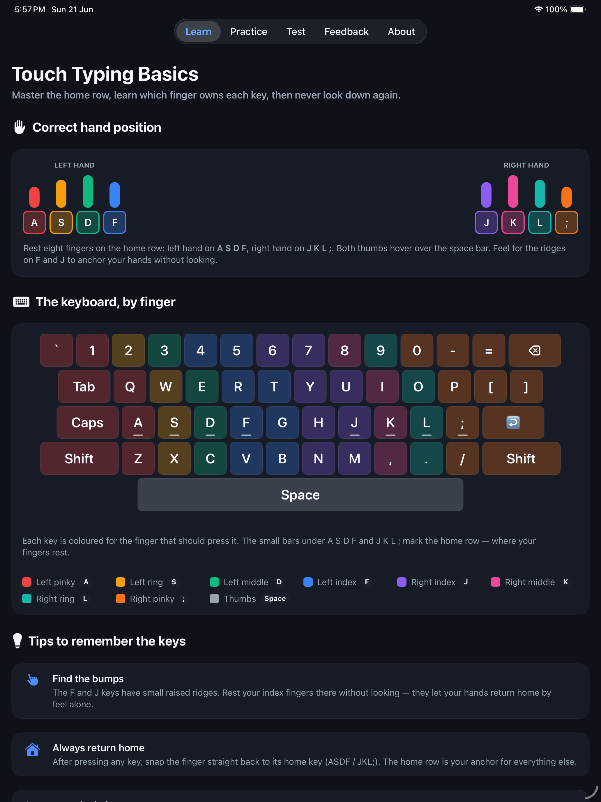

# speedtypingapp

> **SpeedTyping** — a native **iPad-only** app for learning to type fast and accurately, built with SwiftUI.

[](https://apps.apple.com/us/app/tertiary-speedtyping/id6782661288)


SpeedTyping teaches **correct hand position and fingering**, then builds your speed through
graded practice articles, repetitive drills, and timed tests measured in **words- and
characters-per-minute**. Designed for the large iPad canvas.

> 🎉 **Now live on the App Store!** [**Tertiary SpeedTyping**](https://apps.apple.com/us/app/tertiary-speedtyping/id6782661288) is available to download for iPad.



## Features

- ⌨️ **Hand-position & fingering guide** — a QWERTY keyboard with every key colour-coded to the
  finger that should press it, a home-row anchor guide (ASDF / JKL;), and a finger legend.
- 📚 **Practice sessions, basic → expert** — articles of varying length and difficulty
  (Basic, Easy, Intermediate, Advanced, Expert).
- 🔁 **Repetitive fingering drills** — short patterns repeated to build muscle memory, finger by
  finger (home row, left/right hand, index reach, pinky power, bigrams, number row…).
- 💡 **Tips to remember the keys** — posture, the F/J bumps, returning home, accuracy-before-speed.
- ⏱️ **Live speed measurement** — real-time **WPM** and **CPM** plus accuracy, with colour-coded
  per-character feedback as you type.
- ✅ **Graded tests with a configurable pass mark** — pass requires beating the target speed with
  ≥90% accuracy. **Admin** can change the passing speed (WPM) behind a passcode.
- 💬 **Feedback** tab — send a note via WhatsApp.
- ℹ️ **About** tab — app info, developer, and version.

## Screens

| Tab | Purpose |
|-----|---------|
| **Learn** | Correct hand position, finger-coloured keyboard, key-memory tips |
| **Practice** | Articles (basic→expert) + repetitive fingering drills |
| **Test** | Graded passages with pass/fail vs. the admin-set WPM target |
| **Feedback** | Title + message → Send via WhatsApp |
| **About** | App / developer / version |

## Tech Stack

- **SwiftUI** (iPadOS 17+), dark theme, `TabView` bottom navigation
- **Combine** timer-driven `TypingEngine` for live WPM/CPM/accuracy
- `@AppStorage` for the admin-configurable passing mark & passcode
- **XcodeGen** (`project.yml`) for a reproducible, source-controlled project

## Getting Started

```bash
# Requires Xcode 16+ and XcodeGen (brew install xcodegen)
xcodegen generate
open SpeedTyping.xcodeproj
# Select an iPad simulator and run (⌘R)
```

Or from the command line:

```bash
xcodebuild -project SpeedTyping.xcodeproj -scheme SpeedTyping \
  -destination 'platform=iOS Simulator,name=iPad Pro 11-inch (M5)' build
```

## Project Structure

```
SpeedTyping/
├── App/            SpeedTypingApp.swift (entry point)
├── Theme/          Theme.swift (brand tokens, card surface)
├── Models/         Difficulty, TypingItem, Drill, TypingResult
├── Engine/         TypingEngine.swift (WPM/CPM/accuracy)
├── Content/        Fingering map + sample articles, drills, tips
├── Views/          Learn / Practice / Drills / Test / Feedback / About + components
└── Resources/      Assets.xcassets (app icon)
```

## Admin

The **Test** tab has a gear icon → **Admin Settings** (default passcode `2468`, changeable).
There an administrator sets the **passing speed (WPM)** used to grade every test.

## Download

📲 **[Tertiary SpeedTyping on the App Store](https://apps.apple.com/us/app/tertiary-speedtyping/id6782661288)** — free for iPad.

## Acknowledgements

Developed by **[Tertiary Infotech Academy Pte Ltd](https://www.tertiaryinfotech.com)**.

## License

MIT
